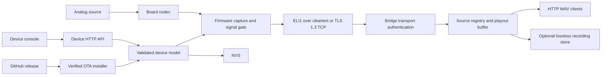
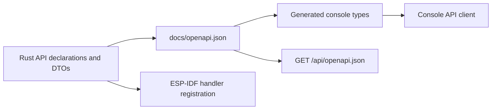

# Architecture

StreamLine captures analog audio on an ESP32 and publishes it as a live HTTP WAV stream through a self-hosted bridge. The device owns capture, local configuration, and transport. The bridge owns network jitter handling, client delivery, and optional lossless recordings. Playback, media-library management, and multiroom synchronization stay outside StreamLine.

This document maps component ownership and cross-component contracts. The linked references own protocol details, operations, security, and user behavior.

## System map

The PCM path is one-way. The control path is API-first: the embedded console calls the same HTTP operations available to scripts and future clients.

## Components

| Component | Owns | Does not own |
|---|---|---|
| `firmware/streamline` | Board selection, codec and I2S capture, signal gating, device configuration, telemetry, HTTP API, TCP sender, OTA | Jitter buffering, audio encoding, playback |
| `console` | Device and bridge consoles, WebFlasher UI, browser-held credential custody, generated API clients | Device or bridge facts, validation authority, persistent runtime state |
| `bridge` | PCM producer admission, per-source playout, loss concealment, HTTP WAV delivery, optional lossless recordings, bridge status | Device configuration, source detection, playback, media-library management |
| `ha-addon` | Home Assistant Supervisor metadata, private recording and transport-key storage mapping, and bridge process wiring | Bridge runtime behavior |
| `webflasher` | Static installer manifest and release-image handoff | Firmware builds, device setup |
| `tools` | Developer-only capture analysis, bounded serial capture, and the boot/API smoke harness for QEMU-emulated and USB-connected devices | Product runtime behavior |
| `.github`, root and component Makefiles | Change selection, checks, release assembly, publishing | Component behavior |

Each component builds from a public base and owns its dependency and tool
configuration. Register every new component or dependency surface in
`.github/dependabot.yml` in the same change. The firmware embeds the device
console build. The bridge packages the bridge console build, and the Home
Assistant add-on packages the bridge. These are deliberate build-time
dependencies, not shared runtime state.

## Firmware boundaries

The Rust library separates portable application logic from ESP-IDF integration:

- Crate-root modules define validated models and policies. They compile and test on the host.
- `adapters/` owns ESP-IDF, hardware, sockets, flash, NVS, and device HTTP bindings.
- `runtime.rs` wires the capture and network tasks on the ESP32.
- `main.rs` is the composition root. It selects setup or provisioned mode once at boot and gives each adapter its dependencies.

Core modules may define narrow traits that adapters implement. Core code does not import a concrete ESP-IDF driver. Hardware observations enter the core as data, and core decisions return as typed values.

### Boot and control flow

1. The firmware opens NVS and resolves a built-in or custom board descriptor.
2. It loads configuration validated against that descriptor.
3. A configured device attempts station Wi-Fi. A device without valid configuration, or one that cannot reach Wi-Fi, starts the setup AP.
4. In provisioned mode, the firmware starts audio capture even when no bridge target exists. It starts the TCP sender only when a target exists.
5. The HTTP server exposes status and configuration in both modes. An empty admin key permits first commissioning; a stored key gates every write.
6. Startup health records whether audio initialized and whether a bridge target exists. It does not control OTA rollback.

The [user journey](user-journey.md) owns the visible behavior of these states. The [security model](security.md) owns who may call each surface.

### Audio flow

The selected board descriptor supplies codec identity, GPIO wiring, input labels, and control limits. The codec adapter configures the hardware, and the I2S adapter reads 48 kHz, 16-bit stereo PCM.

For each captured packet, portable code computes levels and updates the signal gate. The firmware increments the sequence while idle but sends packets only while the gate reports playback. A bounded drop-oldest queue prevents a stalled network from blocking capture. The [PCM protocol](pcm-protocol.md) owns the bytes; the [PCM transport record](tcp-transport.md) owns mode selection, key lifecycle, task placement, timeouts, and reconnect behavior.

### Device API

`firmware/streamline/src/api.rs` owns device routes, methods, authentication metadata, request and response DTOs, and OpenAPI annotations. The ESP-IDF HTTP adapter registers those declarations and binds them to runtime operations.

`make firmware-openapi` generates `docs/openapi.json`. Console checks generate TypeScript types from that artifact. The device serves the same artifact at `GET /api/openapi.json`.

## Bridge boundaries

The bridge runs one PCM listener in either cleartext or authenticated TLS mode. A cleartext source is identified by peer IPv4 address. A TLS source is admitted only after the exact TLS 1.3 PSK profile succeeds and is identified by its authenticated device key id; peer IPv4 remains available for allowlist policy and diagnostics. Each source owns an independent playout pipeline. A newer connection for the same source id replaces the older session so packets from a rebooted device cannot mix with stale packets.

The pipeline buffers packets before playout, follows sequence numbers, attenuates repeated audio across short gaps, emits silence for longer gaps, and re-buffers after a sustained outage. Each HTTP client has a bounded output queue; the bridge disconnects a client that cannot keep up. The [PCM protocol](pcm-protocol.md) owns the media and concealment contract.

The optional recording service taps accepted packets before live concealment,
writes received PCM once, and represents missing sequence positions as silence.
It owns a bounded writer queue and a failure-atomic recording store. The bridge
page calls the same authenticated API available to scripts. [Lossless
recordings](recordings.md) owns the user flow, API, storage lifecycle, and
integrity contract.

`bridge/src/streamline_bridge/http.py` owns bridge routes through FastAPI and
their request and response shapes through Pydantic models. `make
bridge-openapi` generates `docs/bridge-openapi.json` from that runtime app. The
bridge serves the same contract at `GET /api/openapi.json`, and Orval generates
the bridge console client from the checked artifact. The WAV route uses the
same application but keeps media delivery behind a transport-neutral bounded
client stream.

The standalone container and Home Assistant add-on run the same `streamline-bridge` process. `streamline-ha-addon` only translates Supervisor options into bridge CLI arguments. The [bridge reference](bridge.md) owns the runtime endpoints, lifecycle states, and tuning options.

## State ownership

| State | Owner | Lifetime |
|---|---|---|
| Wi-Fi, target, transport mode and keys, audio, admin key, board selection, audio profile catalog | Firmware NVS adapter | Across reboots and firmware updates; the adapter commits a complete inactive generation, then switches one active marker; factory reset selects an empty generation |
| Stream counters and level state | Firmware runtime | One boot |
| OTA progress | Firmware OTA worker | One boot; final diagnostic note persists in NVS |
| Bridge source pipelines and client queues | Bridge process | One bridge process |
| Active recording sessions | Bridge recording service | Until stop, a resource limit, or bridge shutdown |
| WAV recordings and manifests | Bridge recording store | Until an authenticated delete or external storage management |
| Admin key copy and unlock deadline | Browser session storage, with explicit local-storage opt-in | One tab or browser profile |
| Built console, firmware images, release notes | Build and release automation | Generated artifact; never source state |

Persistent and cross-boundary values enter business logic only after parsing and validation. Secrets never appear in read APIs, build artifacts, logs, issues, or documentation examples.

## Contract ownership

| Contract | Source of truth | Derived or checked consumers |
|---|---|---|
| Device HTTP API | Rust `api` module | OpenAPI artifact, device registration check, console types |
| Board descriptor | Rust `board` model and descriptor validation | Built-in JSON catalog, NVS custom descriptor, API capabilities, console controls |
| Audio profile catalog | Rust `profiles` model | NVS records, HTTP JSON, generated console shape |
| PCM frame | [PCM protocol](pcm-protocol.md) | Rust encoder and Python parser, checked by their component tests |
| PCM transport constants | [Machine contract](pcm-transport.json) | Rust and Python constants, mechanically checked by both component tests |
| Bridge device-key map | Bridge transport store | Private versioned file with bounded atomic replacement |
| Release version | Bridge `pyproject.toml`, firmware `Cargo.toml`, add-on `config.yaml` | `make version-check` requires equality |
| User-visible stages | [User journey](user-journey.md) | Console and firmware behavior |
| Security posture | [Security notes](security.md) | Device, bridge, add-on, and deployment guidance |
| Recording timeline and file lifecycle | [Lossless recordings](recordings.md) | Bridge service, HTTP adapter, page, and deployment adapters |

The PCM frame has two hand-written implementations. Keep changes byte-exact and update the protocol, firmware, bridge, and tests together.

## Deployment shapes

The device always runs the embedded console and API. A bridge runs separately in one of two supported shapes:

- The standalone container exposes PCM TCP `39000` in one configured mode and HTTP `8088`.
- The Home Assistant add-on runs the same bridge package with Supervisor-owned options, private transport-key storage, and the same ports.

HTTP clients read `/streamline.wav`; `/status` exposes per-source bridge state;
`/health` is the bridge container liveness probe. A deployment with writable
recording storage also serves `/recordings` and its authenticated API. Music
Assistant, Snapcast, Icecast, editors, and media libraries remain downstream
systems.

## Build, CI, and release

Make is the public command interface. Each component Makefile exposes the verbs that apply to it, and the root Makefile forwards `make <component>-<verb>`. Keep build mechanics behind these targets so local runs and CI execute the same commands.

CI detects changed components and runs their `<component>-check` target. The repository check owns Markdown links and style, documentation examples, repository metadata syntax, and release-version consistency. A `docs/openapi.json` change also runs Rust OpenAPI drift detection and console generation plus type checking. Firmware has a separate job because its ESP-IDF and Cargo caches have different ownership and cost. The shared `firmware-cache` action owns cache restore, ownership handoff, and reclaim for verification and publishing. CI alone saves cache entries. A single `CI complete` job rolls skipped and executed component checks into the branch-protection status.

Tag builds call the same release target used locally, then publish firmware artifacts, bridge images, architecture-specific add-on images, release notes, and the WebFlasher site. The [OTA reference](ota.md) owns image layout and rollback behavior. The root [README](../README.md#releases) owns the operator steps.

The Makefiles remain routing and reproducibility boundaries. Keep component logic in language-native code and split reusable GitHub workflow mechanics into actions when more than one workflow owns the same lifecycle.

## Naming

Use these terms across code, APIs, and docs:

| Term | Meaning |
|---|---|
| device | One ESP32 StreamLine appliance |
| board | The physical ESP32 audio board described by a board descriptor |
| source | A bridge-side PCM producer, identified by peer IPv4 in cleartext mode or authenticated device key id in TLS mode |
| bridge | The process that converts PCM packets to HTTP WAV |
| stream target | The bridge host and TCP port configured on a device |
| client | A consumer reading the bridge's HTTP WAV stream |
| audio profile | A named, board-bound set of input controls |

Use `node` only where an external platform defines that term. Use concrete board and codec names only for concrete descriptors or drivers.

## Document ownership

- [README](../README.md) introduces the product, quick start, development entrypoints, and release procedure.
- This document owns component and dependency boundaries.
- [Design notes](design.md) own architectural decisions and integration choices.
- [Bridge reference](bridge.md) owns bridge endpoints, source lifecycle, and tuning options.
- [Lossless recordings](recordings.md) owns bridge recording behavior, storage, and API semantics.
- [User journey](user-journey.md) owns visible setup, steady-state, and recovery promises.
- [PCM protocol](pcm-protocol.md) and [TCP transport](tcp-transport.md) own the audio wire and runtime transport contracts.
- [Audio profiles](audio-profiles.md), [OTA](ota.md), and [security](security.md) own their feature and risk contracts.
- Component READMEs orient contributors to that component and link to the owning references instead of copying them.
